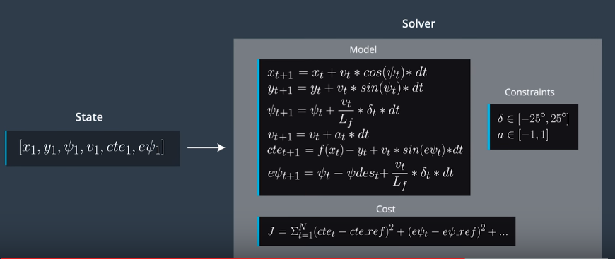
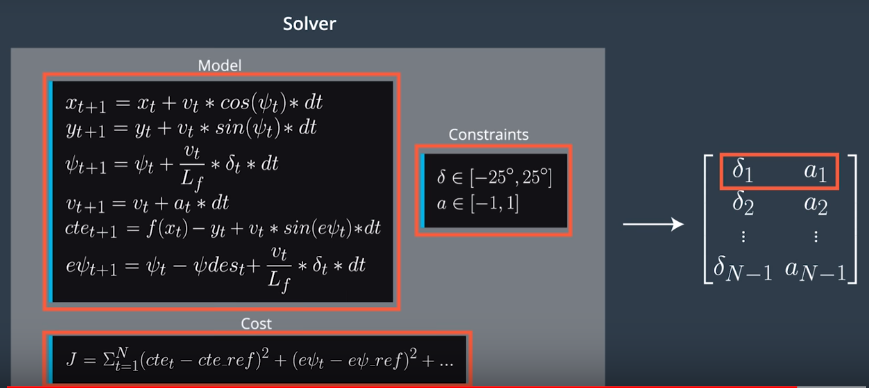
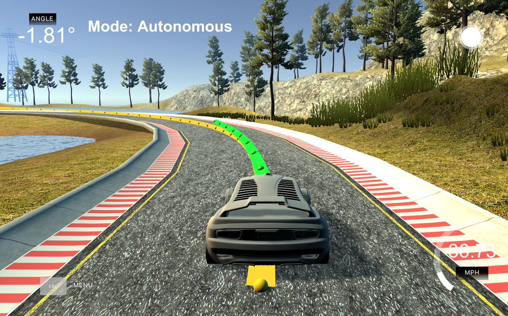

# CarND-MPC-Project
In this project we had to implement Model Predictive Control to drive a car around the track in a simulator. The simulator provided the current state of the car and a list of waypoints of the target trajectory to follow. From this input we had to calculate optimal values for the steering angle and the throttle so that the car would follow the target trajectory smoothly and with a low crosstrack error. Additionally, there was 100 millisecond latency between actuations commands on top of the connection latency. The project code had to handle this latency correctly.

# Implementation
## The Model
The model's input comprised x and y positions, orientation psi, velocity, crosstrack error and orientation error (MPC.cpp: 142-147). 
The update equations from the classroom were used as constraints for the solver (MPC.cpp: 121-126). 

The cost function for the optimizer included the crosstrack error, the orientation error, the reference velocity, the steering and throttle values and the change of steering and throttle between sequential actuations (MPC.cpp: 59-75). 
The output of solver using this model comprised the steering angle, the throttle value and the predicted path (MPC.cpp: 265-272).

## Timestep Length and Elapsed Duration (N & dt)
The time horizon T for predicting the path of the car was chosen to be 1 second. This was devided in N=10 steps with dt=100 ms duration each.

## Polynomial Fitting and MPC Preprocessing
The simulator provided the waypoints in the global coordinate system. I tranformed these waypoints in the car's coordinate system (having the x axis pointing in the direction that car is currently driving). 
With this transformation the current x,y, and psi values were all 0.
For polynomial fitting I used a 3rd order polynomial.

## Model Predictive Control with Latency

To handle the latency of 100 milliseconds, I calculated the state values, the car would have, if it would continue to drive with the current steering and throttle values for the duration of the latency. These adjusted state values were passed to the optimizer, so that the optimizer calculated the optimal values for steering and throttle for a point in time 100ms after the current time.
(main.cpp: 126-132)

# Reflection
With the use of Model Predictive Control the car follows smoothly and closely the target trajectory. The algorithm can also handle latency correctly.

